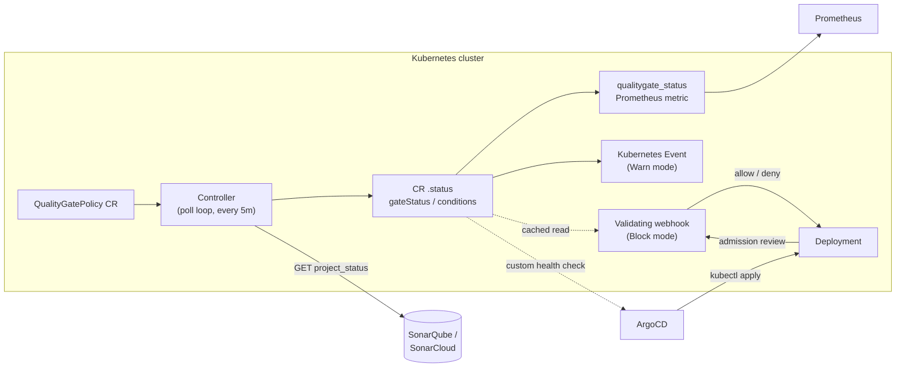

# kube-qgate-operator

Kubernetes operator that gates deployments on SonarQube quality gate status —
block, warn, or audit workloads that don't meet code quality standards.

## The problem

SonarQube quality gates live in CI: a pipeline runs analysis, the gate passes
or fails, and that's the end of it. GitOps deployment is decoupled from that
signal — ArgoCD syncs whatever image tag it sees in Git, with no idea whether
that image ever passed a quality gate. If CI is skipped, a tag is bumped by
hand, or a gate turns red after the fact, nothing on the cluster side stops
it. `kube-qgate-operator` teaches Kubernetes the rule directly:

> This workload may only be deployed from a version that has passed its
> SonarQube quality gate.

The rule is declared with a `QualityGatePolicy` custom resource; the operator
enforces it continuously and automatically inside the cluster.

## Architecture



The controller and the admission webhook are deliberately decoupled: the
webhook never calls SonarQube itself. It only reads the `QualityGatePolicy`'s
already-polled `status.gateStatus`, so admission stays fast and doesn't
depend on SonarQube being reachable at the exact moment a Deployment is
applied. Availability of SonarQube only affects how fresh that cached status
is, governed by `spec.failurePolicy` (see below).

## Quickstart

Requires a Kubernetes cluster (a local [kind](https://kind.sigs.k8s.io/)
cluster is enough for a demo) and, if Block mode is enabled (the default),
[cert-manager](https://cert-manager.io/docs/installation/) for the webhook's
TLS certificate.

No published image exists yet — build and load it into your cluster first:

```bash
docker build -t kube-qgate-operator:demo .
kind load docker-image kube-qgate-operator:demo --name <your-cluster>
```

Install cert-manager (skip if already installed, or if you disable Block
mode / secure metrics — see `values.yaml`):

```bash
kubectl apply -f https://github.com/cert-manager/cert-manager/releases/latest/download/cert-manager.yaml
kubectl wait --for=condition=Available -n cert-manager --timeout=120s \
  deployment/cert-manager deployment/cert-manager-cainjector deployment/cert-manager-webhook
```

Install the operator with Helm:

```bash
helm install kube-qgate-operator ./charts/kube-qgate-operator \
  --namespace kube-qgate-operator-system --create-namespace \
  --set image.repository=kube-qgate-operator --set image.tag=demo
```

Create a policy pointing at a real SonarQube project:

```yaml
apiVersion: qgate.qgate.io/v1alpha1
kind: QualityGatePolicy
metadata:
  name: checkout-service-policy
spec:
  selector:
    matchLabels:
      app: checkout-service
  sonarServer: https://sonarqube.example.com
  projectKey: checkout-service
  mode: Audit   # Audit | Warn | Block
  # sonarTokenSecretRef:
  #   name: sonar-token          # Secret with a "token" key, for private projects
  # failurePolicy: Fail          # Fail | Ignore — Block-mode behavior before the first successful poll
```

```bash
kubectl apply -f my-policy.yaml
kubectl get qualitygatepolicy checkout-service-policy -o yaml
```

Within one reconcile (immediately on create, then every 5 minutes) `status`
fills in:

```yaml
status:
  gateStatus: OK
  lastChecked: "2026-07-26T16:57:59Z"
  matchedWorkloads: [checkout-service]
  conditions:
    - type: Ready
      status: "True"
      reason: GateStatusFetched
```

Switch `mode` to `Block` and any `checkout-service`-labeled Deployment whose
policy's last known `gateStatus` isn't `OK` is rejected at admission with a
clear error message.

## Modes

| Mode  | Effect |
|-------|--------|
| `Audit` | Result written to `status` and the `qualitygate_status` metric only. |
| `Warn`  | Audit, plus a `Warning` Kubernetes Event (`QualityGateFailed`) on the policy when the gate isn't `OK`. |
| `Block` | Warn, plus the validating admission webhook rejects matching Deployments whose gate isn't `OK`. |

## Development

```bash
make test        # unit + envtest (controller and webhook), no cluster required
make test-e2e     # spins up its own kind cluster, installs cert-manager + Prometheus Operator, runs full scenarios
make run          # run the controller against your current kube context
```

## Known limitation

A `QualityGatePolicy` gates against a SonarQube **project's latest analysis**,
not a specific image tag or commit SHA. It answers "is this project's most
recent analysis green," not "did the exact revision behind this container
image pass its gate." Matching a Deployment's image tag/digest to the
specific SonarQube analysis that produced it (via `sonar.analysis.revision`
or an OCI image label) is a natural next step, not yet implemented.

## Why not Keptn or the Gatekeeper external data provider?

Both are the closest existing neighbors, and neither does this out of the
box:

- **Keptn** operates on SLIs/SLOs against runtime metrics (latency, error
  rate) — it has no native concept of a static-analysis quality gate, and
  wiring SonarQube into it means building the same integration this operator
  already provides.
- **Gatekeeper's external data provider** is a generic mechanism for
  admission-time enrichment from an external source. There is no ready-made
  SonarQube provider, and Gatekeeper alone gives you Block-equivalent
  behavior only — no Audit trail, no `qualitygate_status` metric, no ArgoCD
  health-check integration, no polling controller maintaining a status you
  can `kubectl get`.

This project isn't a novel idea — it's the ArgoCD+SonarQube pattern teams
already hand-roll in blog posts and ad-hoc CI scripts, packaged as a single
operator with Audit/Warn/Block modes, metrics, and GitOps integration
included.

## ArgoCD integration

See [`docs/argocd/`](docs/argocd/): a custom health check (`health-check.lua`)
that maps a policy's `Ready` condition and `gateStatus` onto ArgoCD's
Healthy/Degraded/Progressing states, and a PreSync-hook example
(`presync-hook-example.yaml`) that blocks a sync outright until the gate is
confirmed `OK`, for when Degraded-after-sync isn't strict enough.

## Roadmap

- [x] v0.1 — CRD + controller, Audit mode
- [x] v0.2 — Warn mode, Block mode + admission webhook, cert-manager TLS, Prometheus metrics
- [x] v0.3 — Helm chart, e2e tests (envtest + kind), ArgoCD integration docs
- [ ] Pluggable backends beyond SonarQube (Trivy, coverage services)
- [ ] Match Deployments to a specific SonarQube analysis (image tag/commit), not just "latest"
- [ ] Published container image + Helm repo

## License

Apache License 2.0 — see [LICENSE](LICENSE).
